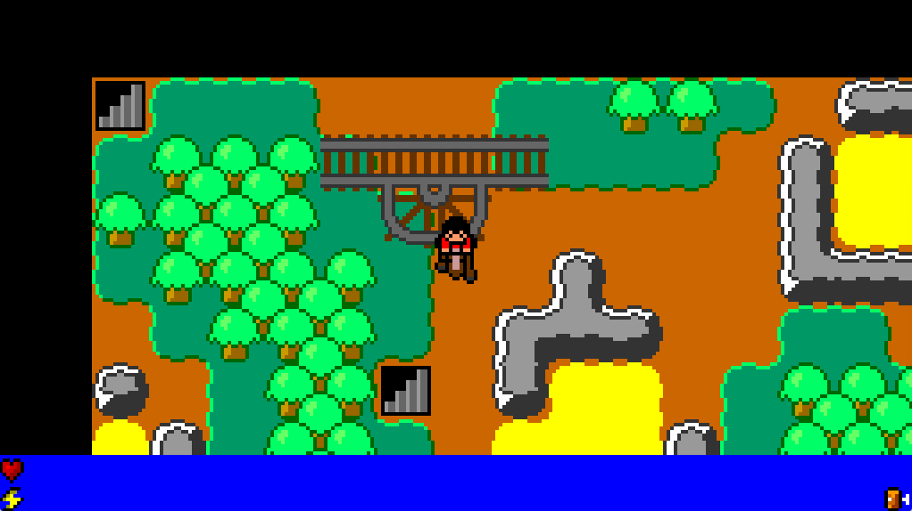

# Minicraft++



### Features

TODO

### Building

#### Windows

```bash
git clone https://github.com/jsoulier/minicraft_plus_plus --recurse-submodules
cd minicraft_plus_plus
mkdir build
cd build
cmake ..
cmake --build . --parallel 8 --config Release
cd bin
./minicraft++.exe
```

#### Linux

```bash
git clone https://github.com/jsoulier/minicraft_plus_plus --recurse-submodules
cd minicraft_plus_plus
mkdir build
cd build
cmake .. -DCMAKE_BUILD_TYPE=Release
cmake --build . --parallel 8
cd bin
./minicraft++
```

### Attributions

 - [Bfxr](https://www.bfxr.net/)